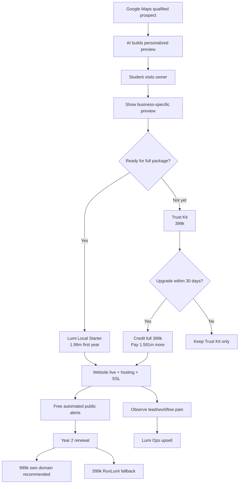
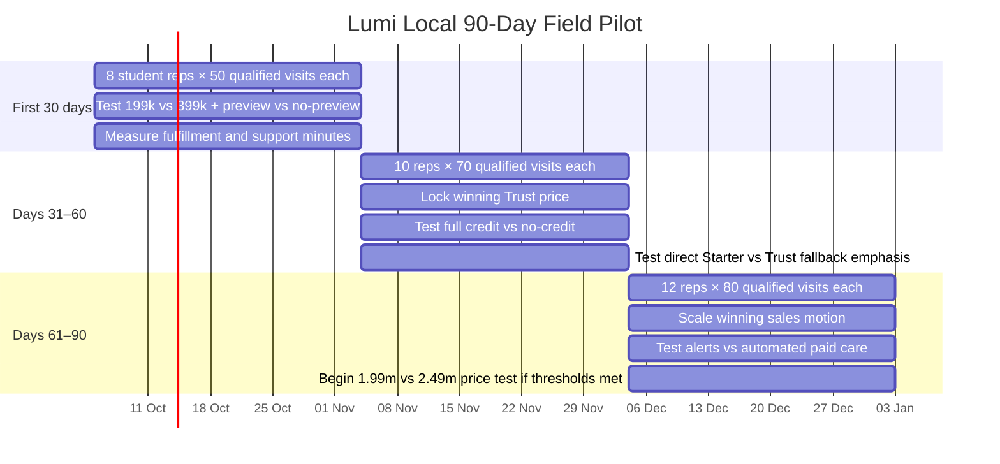

# Executive Summary — Lumi Local Global Comparable Research

The strongest conclusion from the global comparison is that **Lumi Local is not really competing with website builders**. The durable business model is a hybrid of four proven patterns: **UENI’s low-friction done-for-you website**, **Hibu’s local field-sales motion**, **Mono Solutions’ AI-generated proposal website**, and **Thryv/Townsquare’s expansion from online presence into business operations**. In Vietnam, **Nhanh.vn is the most useful direct pricing benchmark**: it currently sells a templated website for **2.4m VND/year**, says delivery is around seven days, can send staff to the shop for consultation/training, and then cross-sells POS, social commerce, shipping and marketing software. citeturn16search1turn16search2turn18search3turn18search0turn20search3turn20search4

The market evidence supports Lumi’s decision to **keep the website early in the funnel rather than making the Trust Kit the business model**. UENI explicitly sells “we build it for you” rather than website-builder software, launching sites in seven days and retaining customers through hosting, domain, email, edits and progressively richer marketing plans. Townsquare combines “Get Found” with CRM, booking, estimates, invoices, payments and automated review requests. Thryv has pushed the same model even further: as of Q2 2026, SaaS represented **76% of Thryv revenue**, monthly SaaS ARPU was **$394**, SaaS gross margin was **63.5%**, and 72% of SaaS revenue came from customers spending more than $400 MRR. citeturn16search0turn16search1turn18search0turn17search1

The strongest warning is equally clear: **cheap done-for-you products only work if human work is aggressively constrained**. Yell starts managed local marketing at roughly £249–£299/month and Accelerate at £699/month; Hibu uses custom pricing, six-to-twelve-month terms and human campaign management; Townsquare provides dedicated onboarding and unlimited US-based support. At those prices, significant service labor is economically possible. Lumi Local at **1.99m VND for year one and 599k/999k renewals cannot copy that service model**. It needs Mono/Spotzer-style industrialization: public data → AI preview → constrained QA → automated deployment → centralized portfolio management → alerts, not continuous manual account management. citeturn17search2turn17search8turn22search0turn18search0turn18search2turn21search1

The most important validation of Lumi’s proposed **AI-preview-before-the-sale** tactic comes from Mono Solutions. Its Quick Creator uses public Google Business Profile data plus AI content and industry imagery to create client websites in minutes, explicitly recommends using the generated site **during the sales conversation**, and creates a trial website subscription that can later be upgraded. Mono says one early reseller using this motion is now selling **more than 80 new websites per month**. That is unusually close to Lumi’s proposed Google Maps → prebuild → student visit → show business its own site motion. citeturn18search3turn18search6turn21search6

The **399k Trust Kit is strategically plausible but not yet validated by the comparables**. Most scaled players lower initial risk with a *free* audit, free trial, refund guarantee, free demo, promotional setup fee, or referral credit rather than a paid diagnostic: Yell uses a free 30-minute/50-point audit; Thryv offers free trials; UENI offers a 30-day money-back guarantee; Nhanh.vn gives referred customers one month free; Haravan offers 14 days free; Sapo seven days. Lumi should therefore treat 399k as a **commitment filter and fallback close**, not force every prospect through it. Its 100% 30-day credit toward the 1.99m Starter is strategically important because it prevents the entry product from becoming a dead-end SKU. citeturn17search3turn17search0turn16search3turn20search0turn19search2turn19search1

My recommended baseline is therefore:

> **Google Maps prospecting → AI-generated personalized preview → student visits owner → attempt 1.99m direct close → 399k Trust Kit as risk-reduction fallback → 100% credit for 30 days → website live → 999k own-domain renewal as recommended default / 599k RunLumi fallback → free automated presence alerts → Lumi Ops only after an observable workflow pain emerges.**

The North Star should **not** be Trust Kits sold or websites generated. It should be **Lumi Local Starter customers per 100 owner conversations**, followed by **12-month contribution margin per owner conversation**. This avoids optimizing the student team for a cheap entry product that never converts to the core recurring relationship.

## Market Pattern and Business-Model Archetypes

The comparables fall into four useful archetypes.

| Archetype | Best examples | What it proves for Lumi |
|---|---|---|
| Done-for-you local presence | UENI, Hibu, Yell | Owners will pay to avoid DIY; website can be the visible entry object while recurring revenue comes from continued presence/marketing. citeturn16search1turn22search0turn17search6 |
| Presence → operations | Thryv, Townsquare Interactive | Website/listings/reviews can lead naturally into CRM, lead handling, booking, invoicing, payments and workflow software. citeturn17search0turn18search0 |
| Industrialized fulfillment infrastructure | Mono Solutions, Spotzer Digital | Website production can be standardized enough for salespeople/partners to sell at scale while centralized technology handles fulfillment. citeturn21search1turn18search2 |
| Vietnam SMB commerce stacks | Sapo, Haravan, KiotViet, Nhanh.vn | Vietnamese SMBs already pay recurring fees for website + operations products; the more durable businesses expand from a simple digital tool into daily operations. citeturn19search0turn19search3turn20search2turn20search7 |

Two economic models emerge.

**High-touch players charge high recurring prices.** Yell’s managed products start in the hundreds of pounds per month, Hibu prices each program to the customer and uses AI plus human expertise, while Townsquare wraps onboarding and unlimited human support around its software. These are not price benchmarks Lumi should imitate; they demonstrate why broad “we manage everything for you forever” scope requires high ARPU. citeturn17search5turn22search0turn18search0

**Low-cost delivery requires industrialization.** Mono builds preview-ready sites in minutes, centrally manages websites, subscriptions, clients, domains and roles, and says hosting/security upkeep is handled at platform level. Spotzer describes its approach as an “industrialised website production model” and reports more than one million digital solutions delivered through enterprise partners. citeturn18search3turn21search4turn18search2

That distinction is decisive for Lumi. A 1.99m VND first-year product can support a short, standardized human QA pass. It cannot economically support indefinite copywriting, GBP editing, SEO consulting, social management, ad management or arbitrary website edits unless those services become separately priced upsells.

There is also a striking Vietnam pricing signal. Nhanh.vn lists its standard website at **2.4m VND/year**; Sapo Web Standard is **499k VND/month** plus a listed 1.5m setup fee before promotions; Haravan’s general Standard package is **300k/month**; KiotViet’s current plans start around **270k/month**, with higher service-sector plans adding website/booking functionality. Lumi Local at **1.99m in year one** therefore sits below several established domestic software/web alternatives while including done-for-you implementation. citeturn20search3turn19search5turn19search2turn15search1

That is potentially a powerful wedge—but it also means **scope discipline is part of the product design, not merely an operational concern**.

## Comparable Companies and Case Studies

**UENI — United Kingdom — founded 2014 — https://ueni.com/**

UENI is the closest direct product analogue. It was incorporated in London in December 2014 and pivoted in 2017 from a local-business discovery app to website and local-marketing services. Its positioning is explicitly anti-DIY: the company says it builds the website in seven days, handles design/copy/SEO, hosts it, supports it, and lets owners remain hands-off. UENI says it has a 120-person remote team spanning 28 nationalities. citeturn16search1

**Ladder and GTM.** Its public pages currently run multiple promotional configurations: headline landing pages advertise launch pricing from roughly **£99 plus £18.99/month**, while the detailed pricing page shows Website Launch, Plus, Ecommerce and Growth annual tiers, with Plus at **£490/year** and Growth at **£949.90/year**, plus setup fees. It uses short onboarding, a seven-day delivery promise, 30 days of done-for-you edits, a 30-day money-back guarantee, examples of real websites, and prorated credits when customers change plans. Higher tiers add ongoing edits, Google Business Profile work, ecommerce and finally a dedicated marketing team. citeturn16search0turn16search3turn16search5

**Economics and operations.** Actual ARPU and gross margin are not public. A defensible public **price-band proxy**, not ARPU, is roughly £228/year at the £18.99 monthly headline base before setup through roughly £950/year for Growth. Fulfillment is clearly hybrid automation + human production; AWS hosts the sites, while designers, copywriters and SEO staff perform creation and edits. UENI claims 700,000+ businesses served and roughly 9,400 Trustpilot reviews on its UK landing page; cumulative “served” should not be confused with active subscribers. citeturn16search3turn16search5

**Retention/KPIs.** Domain, email, hosting, SSL, booking/ecommerce, editing and marketing live inside the recurring relationship. Visible operating metrics include seven-day launch, review score, refund rate—UENI says fewer than 0.5% of customers use its refund guarantee—and cumulative businesses served. citeturn16search3

**Lumi relevance: very high.** The exact lesson is “sell relief from DIY, not code.” The risk is that UENI’s concierge/editorial layers are more labor-intensive than Lumi can afford at Vietnamese pricing. Lumi should copy the *sales promise and industrialized onboarding*, not unlimited human edits.

**Hibu — United States — lineage from 1930; current digital business evolved from Yellowbook — https://hibu.com/**

Hibu is the best analogue for **territory-based field distribution**. Its official material says it has spent more than 80 years serving small businesses; the corporate lineage traces to a directory company founded in 1930. Today Hibu One bundles a professional website, listings, reviews, email/text marketing, lead inbox, reporting, SEO/AIO, ads and deeper multi-location services. citeturn14search5turn15search0turn22search0

**Ladder and GTM.** Hibu does not publish simple sticker pricing; Establish → Reach → Expand is quote-based. Establish builds the foundation, Reach adds fully managed paid media and deeper search optimization, and Expand adds multi-location/campaign management. Contract terms are typically **6–12 months** and an implementation fee pays for its “we-do-it-for-you” setup. It also uses free diagnostics and personalized demos. citeturn22search0

Distribution is especially relevant: Hibu recruits outside reps to cold-call business owners in assigned territories, run needs assessments, and present in person or virtually. Reps earn residual commissions for retained customers, creating explicit incentive alignment between acquisition and retention. Hibu advertises three weeks of classroom training plus nine weeks of field training for new outside reps. citeturn16search2turn16search6

**Economics and operations.** ARPU and gross margin are private and custom ad budgets make a responsible estimate impossible. Manual intensity is **high**: the product combines a proprietary AI-enabled platform with human campaign expertise. Hibu publicly tracks website visits, ad clicks, calls, lead activity and ROI-oriented campaign metrics. citeturn22search0turn22search3

**Lumi relevance: high for distribution, low for service scope.** The main transferable ideas are territory prospecting, structured needs assessment, field training and residual/retention-linked incentives. Lumi should not copy Hibu’s broad managed-marketing scope at a 1.99m VND price point.

**Thryv — United States — founded as Thryv platform/business in 2017 — https://www.thryv.com/**

Thryv is the clearest evidence for the **presence → growth → operations** expansion thesis. Its current Starter plan is **$99/month on annual billing** and includes listings distribution, an AI website builder, AI review management, analytics and support. Signature is **$399/month** and adds a professionally designed website, SEO/AEO, social management, advanced listings, Google Business Profile help and AI lead insights. Beyond that, “Boosts” add done-for-you search, social, brand and advertising services. citeturn17search0

The company identifies 2017 as its founding year for the current platform, and its 2017 predecessor transaction explicitly described Thryv as business-automation software spanning web presence, reviews, scheduling, communications, estimates, invoices and payments. citeturn14search6turn14search2

**Economics.** This is the best public benchmark in the set. In Q2 2026, Thryv reported **95,000 SaaS clients, $394 monthly SaaS ARPU, 63.5% SaaS gross margin, 66.6% adjusted SaaS gross margin and 90% seasoned net revenue retention**. Customers above $400 MRR generated 72% of SaaS revenue. citeturn17search1

**Retention/KPIs.** Its economics make the strategic direction explicit: customer count alone is less valuable than expansion into “quality customers” with higher MRR. Public management metrics center on ARPU, client count, NRR, SaaS revenue mix and gross margin. citeturn17search1

**Lumi relevance: extremely high as an end-state, not an entry-price analogue.** Lumi should interpret the 1.99m website as the acquisition wedge and **Lumi Ops as the eventual economic engine**. Thryv also illustrates the risk of remaining at the low-price end indefinitely: meaningful economics come from customers that adopt more workflow.

**Yell Business — United Kingdom — origins 1966 — https://business.yell.com/**

Yell evolved from the UK Yellow Pages, first published in 1966. Its modern offer is fully managed online presence and demand generation: websites, business listings, reviews, SEO, content and advertising, sold as “one dashboard, one account manager, one monthly payment.” It reports more than **50,000 UK businesses** and over **10,000 five-star Trustpilot reviews**. citeturn17search3turn17search6

**Ladder and GTM.** The lead magnet is a **free 30-minute, 50-point marketing audit**. Amplify is currently advertised around **£249–£299/month** depending on the page/offer; Accelerate starts at **£699/month**, while managed local SEO starts around £300/month. Accelerate includes a Lead Guarantee: Yell agrees a lead quantity and credits the difference if it fails to deliver it. citeturn17search2turn17search5turn17search8

**Economics and operations.** ARPU and gross margin are not publicly broken out in the reviewed sources. List-price revenue is already roughly £3,000–£8,400+ per year before extras, which explains why an account-manager-intensive model is viable. Manual intensity is **high**. Public performance storytelling emphasizes leads, quotes, workloads and client outcomes; for example, Yell’s site says Caledonian Waste Services generated 856 leads and grew from one van to five, a self-reported company case study rather than independent evidence. citeturn17search6

**Lumi relevance: medium-high.** Copy the audit framing, simple outcome language and risk reversal. Do **not** copy a lead guarantee at Lumi’s current maturity: a website/provider cannot safely guarantee customer demand without controlling traffic acquisition and attribution.

**Townsquare Interactive — United States — founded 2012 — https://www.townsquareinteractive.com/**

Townsquare began in 2012 and focuses specifically on owner-operated local businesses. Its site summarizes the model unusually well: **Get Found → Personal Support → Run Your Business**. Get Found includes a newly built AI-optimized website, location/service/blog pages, 200+ business directories, Google Business Profile and reputation management. Run Your Business adds a CRM/inbox, calendar, booking, email/SMS, estimates, invoices, payments and automated post-job review requests. citeturn14search3turn18search0

**Ladder and distribution.** Pricing is custom, with a free quote/demo and no long-term contract advertised. The operating model is materially more human than Lumi’s target: dedicated onboarding, unlimited US support, unlimited optimizations and monthly reporting. The company has both inside and outside sales leadership. citeturn18search0turn14search3

**Economics and traction.** Its site says **23,000+ businesses** use the service. Parent Townsquare Media reported that Townsquare Interactive’s Q2 2026 segment-profit margin reached **nearly 38%**, after a 34% full-year margin in 2025. Segment profit is not the same as gross margin, but it is strong evidence that a mature subscription digital-marketing operation can become profitable despite a service component. citeturn18search0turn18search1turn18search10

**Lumi relevance: extremely high for product ladder.** This is probably the cleanest external validation of “local presence first, business operating system second.” The risk is again labor: Lumi should replicate the ladder without replicating unlimited human support.

**Spotzer Digital — Netherlands — founded 2006 — https://spotzerdigital.com/**

Spotzer is headquartered in Amsterdam and has provided SMB digital-marketing solutions since 2006. Unlike Lumi, it mainly operates B2B2B: telcos, directories, publishers and agencies sell to SMBs while Spotzer provides white-label production and technology. Its current site says it has delivered **more than one million digital solutions**. citeturn14search0turn15search3turn18search2

**Ladder and operations.** Public pricing is not disclosed. Its suite moves from web presence—websites, listings/reviews and social—to performance marketing, ecommerce, booking and broader services. Telstra, Orange and Italiaonline are named partners; Italiaonline specifically describes using Spotzer to build an **industrialized website-production model** for a large customer base. citeturn18search2

ARPU and margins are therefore unknown and not responsibly estimable from public information because wholesale partner terms are private. Manual intensity is best assessed as **medium**: production teams exist, but the entire proposition is centralized fulfillment at scale supported by proprietary/integrated platforms. citeturn18search2

**Lumi relevance: high operationally, medium commercially.** The critical idea is separating **distribution** from **fulfillment**. Student reps should not become mini web agencies. They should sell and collect structured inputs; a centralized Lumi system should produce, QA, deploy and monitor.

**Mono Solutions — Denmark — founded 2007 — https://www.monosolutions.com/**

Mono is arguably the most strategically important technology case. Founded in Copenhagen in 2007, it pivoted to a fully B2B white-label model in 2011. It reports **80,000+ active websites**, with its current homepage saying 70+ partners; its customers include agencies, directories, publishers, telcos and SaaS businesses. citeturn21search0turn21search1

**AI sales/fulfillment motion.** Mono Quick Creator uses public business-listing data, AI-generated content and industry-specific visuals to generate a customized prospect website **in minutes**. Mono explicitly tells sales teams to use it during sales calls, share the preview with the prospect, and then upgrade the trial subscription to a paid site. The Reseller Admin Interface centrally handles websites, clients, subscriptions, domains, roles, workflows and hosting/security. citeturn18search3turn18search6turn21search4

A 2026 Mono case/article says Hjemmesidehuset, an early Quick Creator adopter, now sells **more than 80 new websites per month**. Because this is vendor-published evidence, treat the magnitude as directional rather than independently audited, but the workflow itself is directly observable in Mono’s product. citeturn21search6

**Economics.** Mono does not publish partner ARPU or gross margin. The economic proposition is nevertheless explicit: faster sales, lower fulfillment labor and higher margins. Since its end customers are served through resellers, direct comparison with Lumi’s customer pricing would be misleading. citeturn21search3turn21search6

**Lumi relevance: exceptionally high.** The strongest implication of this research is to make **the personalized preview part of the sales system, not a demo asset produced occasionally**.

**Sapo — Vietnam — founded 2008 — https://www.sapo.vn/**

Sapo was founded in 2008 and reports **230,000 merchants, 20+ offices and roughly 1,000 employees**. It began with online selling/websites and expanded into POS, omnichannel commerce, F&B/services, accounting and related merchant infrastructure. citeturn19search0turn19search4

**Ladder/pricing.** Current plans start at **170k VND/month** for StartUp, 249k for Pro and 449k for Omni. Web Standard is **499k/month**; Advanced is 600k/month under stated plan conditions. Sapo offers a seven-day free trial. A September/October 2026 pricing article states Web Standard has a **1.5m VND setup fee before current promotions**, with hosting and SSL included; domain registration is separate. citeturn19search1turn19search5

That makes Web Standard roughly **5.988m VND/year before setup/domain** at list price—a useful willingness-to-pay anchor against Lumi’s 1.99m first year.

**Economics/retention.** Company ARPU and gross margin are not public. The public plan-price proxy ranges from roughly 2.04m VND/year for StartUp to 5.988m+ for Web Standard and higher as merchants add omnichannel functionality. Retention is strengthened by operational data—inventory, orders, customers, stores and accounting—not just website hosting. citeturn19search0turn19search1

**Lumi relevance: high for Vietnam market validation, medium for direct GTM.** The lesson is that the website is more defensible when it becomes an on-ramp to daily operations. The danger would be copying Sapo’s broad product scope before Lumi has validated its first narrow field wedge.

**Haravan — Vietnam — founded 2014 — https://www.haravan.com/**

Haravan was founded in April 2014 and reports more than **60,000 merchants/brands**. It began with website creation and grew into omnichannel commerce, POS, customer engagement, social commerce, inventory and automation. citeturn19search3turn19search6

**Ladder/GTM.** The current pricing page offers a **14-day free trial**. Its Standard commerce plan is advertised at **300k VND/month** under current pricing, while enterprise implementation reaches 8m VND/month. Website, domain, SEO structure, social/chat connections and broader commerce features are embedded across the product line rather than isolated as a standalone low-cost web agency service. citeturn19search2

**Economics/operations.** Actual ARPU and margin are undisclosed. A reasonable *plan-price proxy*, not ARPU, starts around 3.6m VND annually for the 300k plan; higher-value accounts layer in omnichannel operations and enterprise services. Haravan is lower-manual-intensity than Hibu/Yell because much of the value is software, although enterprise accounts receive dedicated implementation/support. citeturn19search2

**Lumi relevance: medium-high.** It validates the expansion direction and Vietnamese willingness to pay recurring software fees. It is less directly comparable because Haravan primarily targets retailers/ecommerce rather than the salon, garage, clinic, home-services and other offline-first local-service categories Lumi is targeting.

**KiotViet — Vietnam — company established 2010; KiotViet launched 2014 — https://www.kiotviet.vn/**

KiotViet’s parent business dates to 2010 and launched the KiotViet product in 2014. The company reports **300,000 stores, 2,000 employees and coverage across all 63 Vietnamese provinces**; its official history records a **$45m KKR-led investment in 2021**, following earlier rounds. citeturn20search2turn20search5

**Ladder/pricing.** Current pricing begins around **270k VND/month** for lower tiers and 330k/month for Professional on the live pricing page; service-industry higher tiers add website/online-booking, staffing and other operational tools. KiotViet offers free trials and runs highly tangible promotions; in July 2026, for example, a two-year Professional subscription could include POS hardware worth roughly 2.49m VND. citeturn15search1turn15search5

**Economics/retention.** Public ARPU and margin are unknown. At 270k–330k/month, the base plan-price proxy is roughly 3.24m–3.96m VND/year. Retention is naturally stronger than a pure website because inventory, transactions, employees, accounting and business reporting become embedded in daily work. KiotViet’s corporate site explicitly describes customer count and customer satisfaction as success measures. citeturn15search1turn20search2

**Lumi relevance: high as the eventual retention model, lower as the acquisition model.** KiotViet demonstrates why **workflow beats website hosting as long-term lock-in**. Lumi should reach that layer only after the website relationship reveals a specific operational pain.

**Nhanh.vn — Vietnam — current JSC registered 2019 — https://nhanh.vn/**

Nhanh.vn’s current legal entity was registered in 2019 and combines POS, websites, social selling, marketplace management, shipping and marketing services. Its website product is unusually close to Lumi in sticker price: **2.4m VND for one year**, 4.8m for two years with one bonus month, and 7.2m for three years with three bonus months. citeturn20search1turn20search3

**GTM and operations.** Nhanh advertises a free website trial, 200+ templates, approximately seven-day completion, and says staff can visit the store for direct consultation/training. It then cross-sells inventory/order/customer management, shipping, Facebook/social tools, ecommerce and marketing. citeturn20search4turn20search7

Its referral program is particularly useful: an existing customer gets **500k VND** for a successful referral, while the referred customer receives **one free month** of Nhanh software. citeturn20search0

**Economics/traction.** Website list-price revenue is 2.4m/year before add-ons—again, a price proxy rather than company ARPU. Nhanh claims 100,000+ merchants across its broader platform and 2,000+ websites on a product page. citeturn20search4turn20search7

**Lumi relevance: very high locally.** The key insight is that **1.99m is not obviously too expensive for Vietnam**; it is actually below Nhanh’s published annual web price. Nhanh also validates onsite assistance and “web → operations” cross-sell. Lumi’s differentiation should be better field personalization, dramatically faster AI fulfillment and a stronger done-for-you local-service experience.

## Cross-Company Comparison

“Manual ops intensity” below is my assessment of the delivery model rather than a company-reported metric. Prices are current public prices/promotions observed on October 4, 2026; quote-based products can vary by customer and advertising budget.

| Company | Country | Entry price | Core price | Renewal | Distribution | Recurring? | Manual ops intensity | Upsell path | Traction signal |
|---|---|---:|---:|---|---|---|---|---|---|
| **UENI** citeturn16search0turn16search1 | UK | Promo from ~£99 setup; 30-day guarantee | ~£18.99/mo base; Plus £490/yr | Monthly/annual | Online/direct | Yes | **Med** | Website → edits/GBP → ecommerce → Growth marketing | 700k+ businesses served claim; ~9.4k Trustpilot reviews citeturn16search3 |
| **Hibu** citeturn22search0turn16search6 | US | Free tools/demo; custom setup | Custom | 6–12 mo contracts, then ongoing | **Outside field sales**, phone, digital | Yes | **High** | Presence → SEO/ads → lead management → multi-location | Tens of thousands of SMB clients; large national field-sales organization citeturn14search1turn16search6 |
| **Thryv** citeturn17search0 | US | Free trial | $99/mo Starter; $399/mo Signature | Subscription; annual saves 15% | Direct sales/digital | Yes | **Med** | Presence → professional web/SEO → Boosts → CRM/workflows | 95k SaaS clients; $394 ARPU; 63.5% SaaS GM citeturn17search1 |
| **Yell** citeturn17search3turn17search6 | UK | Free 30-min audit | Amplify ~£249–299/mo; Accelerate £699/mo | Monthly managed relationship | Direct telesales/digital/account managers | Yes | **High** | Website/presence → SEO → managed ads | 50k+ businesses; 10k+ five-star reviews citeturn17search6 |
| **Townsquare Interactive** citeturn18search0 | US | Free quote/demo | Custom | Month-to-month/no long-term contract advertised | Inside + outside sales | Yes | **High** | Get Found → CRM/booking → estimates/invoices/payments | 23k+ businesses; Q2 segment-profit margin nearly 38% citeturn18search0turn18search1 |
| **Spotzer Digital** citeturn18search2 | Netherlands | Partner quote | Wholesale/quote | Partner contracts | Telcos, directories, agencies, white label | Yes | **Med** | Web → listings/reviews → ecommerce → performance marketing | >1m digital solutions delivered; Telstra/Orange/Italiaonline partners citeturn18search2 |
| **Mono Solutions** citeturn21search0turn21search1 | Denmark | Partner free trial | B2B quote | Site subscriptions | Resellers/telcos/agencies | Yes | **Low** | AI website → domain/email → ecommerce/add-ons | 80k+ active sites; 70+ partners on current homepage citeturn21search0turn21search1 |
| **Sapo** citeturn19search0turn19search1 | Vietnam | 7-day trial | Web Standard 499k VND/mo + setup | Subscription | Direct, 20+ offices, partners | Yes | **Med** | Website → POS → omnichannel → accounting/operations | 230k merchants, 1,000 employees citeturn19search0 |
| **Haravan** citeturn19search2turn19search3 | Vietnam | 14-day trial | Standard 300k VND/mo; higher web/omnichannel tiers | Subscription | Direct/partner ecosystem | Yes | **Low–Med** | Website → omnichannel → engagement → enterprise | 60k+ customers citeturn19search3 |
| **KiotViet** citeturn15search1turn20search2 | Vietnam | Free trial | ~270k–330k VND/mo base; higher service plans | Subscription | Large direct/local sales + support network | Yes | **Med** | POS → website/booking → staffing/accounting/finance | 300k stores; $45m KKR round in 2021 citeturn20search2 |
| **Nhanh.vn** citeturn20search3turn20search4 | Vietnam | Free trial | 2.4m VND/year website | Annual; multi-year bonus months | Direct + **onsite support** + referrals | Yes | **Med** | Website → POS → Vpage/ecom → shipping/marketing | 100k+ merchants claimed; 2k+ websites citeturn20search4turn20search7 |

The pattern is hard to miss: **every durable comparable makes the website either recurring infrastructure or the first layer of a larger business system**. The companies with the strongest economics do not rely on repeatedly selling one-off websites. Thryv monetizes higher-value SaaS users; Townsquare pushes into business management; Sapo/Haravan/KiotViet/Nhanh embed themselves in merchant operations; Mono and Spotzer monetize the infrastructure required for thousands of recurring websites. citeturn17search1turn18search0turn19search0turn19search3turn20search2turn21search1turn18search2

## GTM Recommendations for Lumi Local

**Make the AI preview the default sales artifact, not an occasional trick.** Mono is the clearest precedent: public business data becomes a personalized site, and the salesperson can show it during the first conversation rather than asking the owner to imagine a future website. citeturn18search3turn21search6

For every sufficiently qualified Google Maps lead, Lumi should create a low-cost preview **before** the student visits. Keep it intentionally non-production: owner name/business name, representative imagery, services, Call/Zalo/Maps, indicative review surface, and clear “preview” labeling.

The field opening should be:

> “I found your business on Google and prepared this draft from public information so you can see what Lumi Local would look like for your business. This is only a preview—we haven’t published anything. If you like the direction, we finish the content, connect Call/Zalo, publish it, handle the domain/hosting and keep the technical side running. The full first year is 1.99 million.”

That script makes the product concrete before price negotiation.

**Treat 399k as the fallback close, not the mandatory first step.** Scaled comparables generally use free audits, trials, demos and guarantees to lower risk rather than forcing a small paid product before the core sale. citeturn17search3turn17search0turn16search3turn19search1turn19search2

The recommended field decision tree is therefore:

The Trust fallback script should remain brutally simple:

> “No problem. You can start smaller with the 399k Trust Kit—review QR, standee and an online-presence check. If you decide to do Lumi Local within 30 days, the entire 399k is deducted, so you only add 1.591 million.”

The economic objective is not to maximize 399k purchases. It is to recover prospects who would otherwise leave with **zero transaction** and move a meaningful fraction into Starter.

**Make the 999k own-domain renewal the recommended plan, not an upsell surprise.** The comparables routinely bundle domain, hosting, SSL and continuity into the recurring relationship: UENI does so explicitly, while Mono centrally manages website subscriptions, domains and hosting. citeturn16search0turn21search1turn21search4

Present the lifecycle on day one:

> “The first year is 1.99m. From year two, most established businesses choose 999k/year to keep their own domain, hosting, SSL and technical maintenance. If you only need the lower-cost RunLumi address, it is 599k/year.”

That reduces renewal shock and changes the mental model from “I bought a webpage” to “Lumi runs this business asset.”

**Do not launch a 99k/month human Local Care product.** High-touch comparables can afford account managers because their ARPU is hundreds of dollars or pounds per month. Lumi cannot layer similar human service onto a sub-100k or 99k VND recurring fee without destroying the economics. citeturn17search1turn17search5turn22search0turn18search0

Keep **Free Local Presence Alerts** narrow and automated:

> “Lumi monitors the public technical signals we can observe. If we see something important—site down, SSL/domain issue, broken link or a supported public-presence anomaly—we alert you. We do not log into or manage your Google Business Profile.”

A paid care experiment is worth running only as a **falsification test** and only if the service remains automated. Never let a 99k SKU quietly turn into “message us whenever anything online is wrong.”

**Align student compensation to Starter and retention, not activity or Trust Kits.** Hibu’s outside reps prospect territories, present in person and earn residual commissions for retained clients; that is a stronger incentive design than paying primarily for meetings or low-ticket sales. citeturn16search2turn16search6

A reasonable pilot compensation design—not a market fact, but a Lumi experiment—would be:

| Event | Suggested pilot payout |
|---|---:|
| Trust Kit paid | **100k VND** |
| Direct Starter paid | **350k VND** |
| Trust Kit later upgrades to Starter | **+250k VND** |
| Customer still live/paid at 90 days | **+50k VND quality bonus** |

This keeps total acquisition bounty around 350k–400k for a successful core customer while making “sell 20 Trust Kits and disappear” economically unattractive.

## Pilot, Metrics, and Experiment Design

The pilot should optimize for **Starter economics**, not vanity sales volume.

The two primary metrics should be:

**Starter Paid per 100 Owner Conversations**

and

**12-Month Expected Contribution Margin per Owner Conversation**

The first measures whether the field motion actually converts decision-makers. The second prevents an apparently successful cheap offer from producing low-quality, high-support customers.

Supporting acquisition metrics should include qualified businesses mapped, visits, owner-contact rate, owner conversations, previews shown, direct Starter closes, Trust Kit closes, Trust→Starter upgrades, payment collection rate, days-to-close and referral rate.

Economic metrics should include rep bounty, transport cost, AI-generation cost, human fulfillment minutes, domain/hosting cost, support minutes, refunds, contribution margin and CAC per paid Starter. Delivery metrics should include preview-generation time, payment-to-first-draft, payment-to-live, revision count, deployment failures and broken Call/Zalo/Maps links. Retention metrics should include 30/60/90-day site-active rate, own-domain adoption, support events/account, alert engagement and eventually the **real 12-month renewal rate**. Operations-expansion metrics should track how many customers exhibit lead leakage, appointment/reminder pain, quotation follow-up pain or owner-visibility pain, and what percentage accept a Lumi Ops demo.

I would use these initial **go/no-go thresholds**:

| Metric | Early acceptable | Scale target |
|---|---:|---:|
| Owner conversations / qualified visits | ≥45% | **≥55%** |
| Preview shown / owner conversation | ≥60% | **≥75%** |
| Trust Kit paid / owner conversation at 399k | ≥10% | **≥15%** |
| Trust Kit paid / owner conversation at 199k | ≥15% | **≥20%** |
| Direct Starter paid / owner conversation | ≥3% | **≥5%** |
| Trust → Starter within 30 days | ≥25% | **≥35%** |
| **Total Starter paid / owner conversation** | ≥7% | **≥10%** |
| Variable CAC / Starter | ≤600k | **≤500k VND** |
| Median human fulfillment time / Starter | ≤120 min | **≤90 min** |
| p90 human fulfillment time | ≤240 min | **≤180 min** |
| One-or-fewer revision rounds | ≥70% | **≥80%** |
| Refund/cancellation in first 30 days | <8% | **<5%** |
| Site active at day 90 | ≥85% | **≥90%** |
| Passive-alert human work | <10 min/account/mo | **<5 min/account/mo** |

These are **recommended internal thresholds**, not industry benchmarks.

The test matrix should use **business-level randomization within each rep and neighborhood**, not “Rep A gets offer A, Rep B gets offer B.” Otherwise salesperson quality and geography become confounded with the offer.

| Experiment | A | B | Primary metric | Decision rule |
|---|---|---|---|---|
| **Trust Kit price** | 399k | 199k | Starter paid / 100 owner conversations; contribution margin / conversation | 199k wins only if extra upgrades outweigh the 200k entry discount |
| **Credit** | 100% of Trust Kit credited for 30 days | No credit | Trust→Starter conversion + total cash/customer | Keep full credit unless no-credit produces materially higher total contribution with no trust penalty |
| **AI preview** | Personalized preview ready before visit | Verbal/sample-only pitch | Starter conversion, sales-cycle time | Require ≥25–30% relative lift or substantial cycle-time reduction |
| **Alerts** | Free automated alerts | 99k/month automated Care | 60-day paid retention, support minutes, contribution | Paid Care survives only if customers buy it **and** support remains near-zero |
| **Core price, later stage** | 1.99m | 2.49m | Contribution margin / owner conversation | Run only after conversion motion is stable; price up if close-rate loss is smaller than revenue gain |
| **Renewal framing** | 999k own domain shown as recommended | 599k RunLumi shown first | Own-domain selection + Starter conversion | Prefer 999k default unless it measurably hurts first-year close rate |

The credit/no-credit test deserves caution. A “no credit” arm must be completely transparent at the moment of purchase. A hidden or retroactively removed credit would contaminate the experiment by creating distrust rather than measuring price sensitivity.

A practical 90-day rollout:

**First 30 days:** use **8 student reps × 50 qualified visits = 400 visits**. Run a 2×2 test: 399k vs 199k and AI preview vs no personalized preview, while keeping the 30-day 100% credit constant. Do not add more variables yet. The gating result is not “which Trust Kit sells more”; it is which arm produces the best **Starter conversion and cash contribution per owner conversation**.

At day 30, continue only if the field team is reaching owners at least ~45% of qualified visits and the blended path is producing at least ~7 Starter customers per 100 owner conversations or showing a clearly improving trend. A Trust Kit that closes well while fewer than 20–25% upgrade is a warning sign: the wedge may be satisfying a different demand than the core product.

**Days 31–60:** increase to **10 reps × 70 visits = 700 incremental visits**. Lock the winning entry price and test **100% credit vs no credit**, while comparing “direct Starter first, Trust as fallback” against a Trust-first pitch. This phase should also produce enough deliveries to know whether the true human fulfillment requirement is compatible with a 1.99m product.

By day 60, the scale gate should be roughly **≥10 Starter closes per 100 owner conversations, ≤500k variable CAC per Starter, ≤90 median human fulfillment minutes, and <5% early refunds**. Failure of the sales threshold means fix the wedge/pitch; failure of the delivery threshold means fix the product factory before hiring more reps.

**Days 61–90:** move to **12 reps × 80 visits = 960 incremental visits**, largely using the winning motion. Test free alerts versus a strictly automated 99k Care experiment among eligible customers, and—only if the 1.99m offer is already converting comfortably—begin a 1.99m vs 2.49m Starter price test.

This gives roughly **2,060 qualified business visits over 90 days**. At a 50–55% owner-conversation rate, Lumi would collect around 1,000+ real owner conversations—enough to distinguish a repeatable field motion from a handful of charismatic-rep anecdotes.

The most important dashboard should fit on one screen:

> **Visits → Owner Conversations → Preview Shown → Trust Paid → Direct Starter Paid → Trust→Starter Paid → Total Starter CAC → Median Fulfillment Minutes → 30/60/90 Active → Renewal → Ops Attach**

Anything that does not help explain one of those transitions is secondary during the pilot.

## UX References and Research Caveats

These live competitor pages are particularly useful references for the next Lumi Local landing-page refinement:

| Reference | URL | Pattern worth studying |
|---|---|---|
| **UENI** | https://ueni.com/en-gb/ | Excellent articulation of **done-for-you vs DIY vs agency**; price, seven-day outcome, examples and guarantee appear early. Its product page explicitly makes “we do the work” the hero rather than AI technology. citeturn16search3 |
| **UENI pricing** | https://ueni.com/en-gb/pricing/ | Strong vertical ladder from website → management → ecommerce → growth, with clear inclusions and low-risk guarantee. citeturn16search0 |
| **Thryv pricing** | https://www.thryv.com/pricing/ | Good example of making **Starter → Signature → done-for-you Boosts** visually obvious without pretending every tier is the same product. citeturn17search0 |
| **Yell Business** | https://business.yell.com/ | Strong local-business copy: one dashboard, one account manager, one payment; free audit; tangible customer outcomes; risk reversal. It is useful inspiration but considerably more “agency” than Lumi should become. citeturn17search6 |
| **Townsquare Interactive pricing** | https://www.townsquareinteractive.com/pricing/ | Best information architecture for Lumi’s longer-term story: **Get Found → real support → Run Your Business**. citeturn18search0 |
| **Mono Quick Creator** | https://www.monosolutions.com/platform/quick-creator-ai | Most relevant demonstration of the **website preview as sales object**. Its UI/workflow is worth studying as much as its marketing page. citeturn18search3 |
| **Nhanh.vn website pricing** | https://nhanh.vn/bang-gia-website | Best local pricing reference: one straightforward annual web price and multi-year renewal incentives. citeturn20search3 |
| **Sapo pricing** | https://www.sapo.vn/bang-gia.html | Useful Vietnamese example of moving the buyer from a simple starting plan into website and increasingly operational software. citeturn19search1 |

Three UX patterns are especially worth carrying into Lumi.

First, **show the finished outcome before explaining the technology**. UENI shows real websites; Mono makes the personalized proposal itself the product demo; Townsquare organizes benefits around what the business is trying to accomplish rather than around technical modules. citeturn16search3turn21search6turn18search0

Second, **make the ladder visually asymmetric**. The core offer should dominate. UENI and Thryv have obvious progression paths; for Lumi the page should visually say:

> **1.99m Lumi Local Starter = the thing to buy**  
> 399k Trust Kit = the low-risk fallback  
> 999k/year = the normal continuity plan  
> 599k/year = the budget fallback

That is preferable to presenting three equal cards and accidentally training visitors to pick the cheapest one.

Third, **use proof of process until Lumi has proof of outcomes**. Established competitors use tens of thousands of customers, reviews and performance case studies because they have them. Lumi should not fabricate equivalents. Early trust should come from a real personalized preview, transparent pricing, examples, exact deliverables, own-domain ownership, a clear “no Google credentials required” promise, fast time-to-live and photos/video showing the actual field/fulfillment process. The large incumbents’ heavy reliance on reviews, customer counts and case studies shows how important proof eventually becomes, but not a reason to manufacture it early. citeturn16search3turn17search6turn18search0

A final research caution: public “customers served,” “businesses,” “stores,” “websites” and “partners” are not interchangeable with paying active accounts. Likewise, company case studies from UENI, Hibu, Yell and Mono are useful evidence of the mechanism but are self-published and should not be treated as independently audited performance. Where private companies did not publish ARPU or gross margin, I have deliberately used **list-price proxies or marked the figure unknown rather than inventing false precision**. The strongest externally verifiable economics in this group are Thryv’s public SaaS ARPU/gross-margin/NRR disclosures and Townsquare’s public segment-profit margins. citeturn17search1turn18search1turn18search10

The overall strategic conclusion is therefore unusually consistent across markets:

> **Lumi should commoditize website production faster than anyone else, but never sell itself as a commodity website builder.**
>
> **Use AI to collapse fulfillment cost. Use a personalized website to create the first “wow.” Use students/local reps to solve distribution. Use domain/hosting to create low-effort recurring revenue. Then earn the right to sell Lumi Ops by observing a real operational problem.**

That combination—**Distribution → Trust → Ownership → Workflow**—is better aligned with the evidence than either a traditional Vietnamese web agency or a pure self-service AI website builder.