# Founder memo: Google Maps, local presence và cơ hội GTM cho Lumi Local tại Việt Nam

*Tình trạng nghiên cứu: cập nhật đến ngày 6/10/2026. Trọng tâm là hành vi mua dịch vụ quanh Google Maps/Google Business Profile tại Việt Nam, đối thủ local, marketplace, mô hình phân phối và các page có khả năng tạo demand cho Lumi Local.*

## Tóm tắt điều hành

Kết luận lớn nhất là: **người mua Việt Nam hiện không tìm một khái niệm rộng như “local presence solution”. Họ tìm theo một vấn đề cụ thể đang đau**: “xác minh Google Maps”, “dịch vụ Google Maps”, “SEO Google Maps”, “Google Maps bị khóa”, “mất quyền Google Maps”, “review Google Maps”, “quảng cáo Google Maps”, hoặc “tạo địa điểm trên Google Maps”. Cấu trúc dịch vụ của Tenzen, LeadUp, Omni Digital, MONA, VIMA và SEONGON đều phản ánh hành vi này. citeturn24search0turn25search0turn24search1turn26search1

Đây là một tín hiệu rất tốt cho Lumi. **Không cần giáo dục thị trường về một category hoàn toàn mới.** Google Maps đã là “cửa vào”; Lumi chỉ cần dùng đúng pain keyword để lấy lead rồi chuyển khách sang sản phẩm rộng hơn là **Lumi Local**.

Thị trường đang có một khoảng trống khá rõ:

> Các agency hiện bán **quản lý/tối ưu Maps bằng con người** hoặc **SEO/Ads hàng tháng**.  
> Lumi có thể bán **presence infrastructure done-for-you với chi phí delivery cực thấp**, trong khi **không sở hữu hoặc vận hành Google Business Profile của khách**.

Google Business Profile bản thân là miễn phí; Google nói local results chủ yếu dựa trên **relevance, distance và prominence**, đồng thời nói rõ rằng không thể trả tiền để có local ranking tốt hơn. Do đó, lời hứa kiểu “bao top Maps” vừa khó tạo moat vừa dễ kéo Lumi vào expectation-management dài hạn. citeturn0search0turn23search2

Ngược lại, quyết định trước đó của Lumi — **không yêu cầu quyền chỉnh sửa Google Maps** — là một lợi thế positioning đáng khai thác. Google yêu cầu bên thứ ba phải có consent rõ ràng, và doanh nghiệp phải luôn giữ quyền owner/co-owner đối với profile của mình. citeturn6search2turn6search6

Về review, Lumi cũng có cơ hội khác biệt rất rõ. Google chính thức cho phép doanh nghiệp tạo **link hoặc QR code để mời khách thật để lại review**, nhưng cấm trả thưởng, mua review, fake engagement và selective solicitation. Trong khi đó, thị trường Việt Nam vẫn có khá nhiều offer bán review hoặc “review 5 sao”, kể cả trên marketplace. citeturn6search3turn6search0turn25search4turn27search5

Tôi vì vậy sẽ giữ economic engine:

> **Pain keyword / field discovery → Trust Kit 399k → Lumi Local Starter 1,99m → 599k/999k annual renewal → free passive alerts → Lumi Ops**

và **không** biến Lumi thành một agency “chăm Maps 1 triệu/tháng”.

Một điểm đáng chú ý nữa là mức 1,99 triệu năm đầu thực ra rất aggressive. Một bài hướng dẫn giá website mới của Sapo đặt website trọn gói phổ biến ở khoảng 6–20 triệu đồng; riêng domain phổ biến có thể khoảng 700–800 nghìn/năm theo bài tổng hợp đó. Trang giá domain chính thức của Sapo hiện niêm yết `.com` khoảng 430 nghìn/năm và `.vn` gia hạn khoảng 470 nghìn/năm. Vì vậy Lumi có thể trông “rẻ bất thường” so với web agency truyền thống, nhưng cần bảo vệ unit economics của gói 999k/năm nếu bao gồm cả tên miền. citeturn29search2turn29search6

Thị trường online Việt Nam đủ lớn cho motion này: DataReportal ước tính 85,6 triệu người dùng internet vào tháng 10/2025, tương đương 84,2% dân số, trong báo cáo Digital 2026 Vietnam. citeturn30search0

**Founder recommendation:** đừng xây landing page chỉ quanh từ “website”. Hãy xây một **search-intent surface area** quanh Google Maps problems, rồi dùng mỗi pain page như một cửa khác nhau dẫn vào cùng Lumi Local funnel.

## Bản đồ nhu cầu tìm kiếm và keyword

Tôi không tìm thấy một nguồn công khai có thể tái lập được, cung cấp **volume hàng tháng cụ thể tại Việt Nam cho từng query** mà không cần tài khoản/công cụ trả phí. Semrush mô tả monthly search volume là metric của keyword tool; Keyword Tool cũng cung cấp volume theo quốc gia nhưng phần dữ liệu chi tiết nằm trong sản phẩm trả phí. Vì vậy tôi **không bịa số volume**. citeturn10search0turn10search2

Thay vào đó, bảng dưới dùng **Demand Proxy** dựa trên ba tín hiệu: số lượng service page cạnh tranh xuất hiện, mức độ thương mại của SERP, và việc các agency có tạo riêng offer/pricing cho intent đó hay không. Tenzen, LeadUp, Omni, MONA, VIMA và SEONGON đều có page riêng cho nhiều nhóm intent dưới đây. citeturn24search0turn25search0turn26search1turn26search2

| Ưu tiên | Keyword / cluster tiếng Việt | Search intent | Volume công khai | Demand proxy | Lumi nên phục vụ bằng |
|---|---|---|---|---|---|
| **A+** | **dịch vụ Google Maps / dịch vụ Google Map** | Thuê ngay / so vendor | Không có số đáng tin công khai | **5/5** | `/dich-vu-google-maps` |
| **A+** | **SEO Google Maps / SEO Google Map** | Muốn tăng hiển thị | Không có số đáng tin công khai | **5/5** | Guide/audit page, **không hứa ranking** |
| **A+** | **xác minh Google Maps / xác minh Google Map** | Problem-solving, WTP rõ | Không có số đáng tin công khai | **5/5** | `/xac-minh-google-maps` |
| **A** | **tạo Google Maps / tạo địa điểm trên Google Maps** | DIY + assisted | Không có số đáng tin công khai | **5/5 traffic, 3/5 commercial** | How-to → assisted offer |
| **A** | **đưa địa chỉ lên Google Maps** | DIY / mới mở cửa hàng | Không có số đáng tin công khai | **4/5** | Guide → Trust Kit |
| **A** | **Google Maps bị khóa / bị vô hiệu hóa** | Acute pain | Không có số đáng tin công khai | **4/5 volume, 5/5 WTP** | `/google-maps-bi-khoa` |
| **A** | **mất quyền Google Maps / lấy lại Google Maps** | Acute pain | Không có số đáng tin công khai | **4/5** | Maps Rescue |
| **A** | **review Google Maps / tăng đánh giá Google Maps** | Reputation | Không có số đáng tin công khai | **4/5** | `/qr-review-google`, policy-safe |
| **B+** | **quảng cáo Google Maps** | Paid acquisition | Không có số đáng tin công khai | **4/5** | Content page initially; partner later |
| **B+** | **Google Maps không hiện / sai địa chỉ / sai vị trí** | Troubleshooting | Không có số đáng tin công khai | **3–4/5** | Audit/diagnostic |
| **B** | **Local SEO / SEO địa phương** | Sophisticated SME/marketer | Không có số đáng tin công khai | **3/5** | Educational page |
| **B** | **website doanh nghiệp / website cửa hàng + ngành** | Website purchase | Không có số đáng tin công khai | Lớn nhưng cạnh tranh rộng | Vertical Lumi Local pages |

Search intent “xác minh” đặc biệt đáng chú ý. LeadUp bán trực tiếp setup/xác minh trên vLance với mức 900.000đ cho một vị trí; Omni niêm yết 700.000đ cho khởi tạo & xác minh; Tenzen niêm yết 1.000.000đ cho gói cơ bản có xác minh. Đây là ba điểm giá độc lập cho thấy **SME Việt Nam đã quen với việc trả vài trăm nghìn đến khoảng một triệu đồng để giải quyết một problem mà về lý thuyết Google cung cấp miễn phí**. citeturn25search1turn24search1turn24search0

Đó là insight quan trọng:

> **Người ta không trả tiền cho access vào Google Maps. Người ta trả tiền để khỏi phải hiểu và tự xử lý Google Maps.**

Lumi có thể áp dụng chính logic đó cho website.

Google cho biết verification có thể cần review, có thể yêu cầu re-verification, và doanh nghiệp phải được xác minh trước khi có đầy đủ khả năng chỉnh sửa/tương tác. Điều này giải thích vì sao “xác minh” trở thành một service category dù sản phẩm gốc miễn phí. citeturn16search0

### Keyword không nên biến thành promise

`SEO Google Maps` rất hấp dẫn về demand nhưng tôi **không** biến nó thành managed service lúc này.

Google nói local ranking chủ yếu phụ thuộc vào relevance, distance và prominence; thông tin đầy đủ, verification, giờ mở cửa, review, ảnh/video đều có thể giúp profile tốt hơn, nhưng Google đồng thời nói rõ **không thể yêu cầu hoặc trả tiền để có thứ hạng local tốt hơn**. citeturn23search2

Vì vậy page có thể target:

> **SEO Google Maps là gì? 12 điểm business tự kiểm tra trước khi thuê dịch vụ**

CTA:

> **Kiểm tra Lumi Local miễn phí**

chứ không phải:

> “Lumi đưa bạn Top 3 Maps”.

Đây là cách **capture demand mà không inherit liability của keyword**.

## Cạnh tranh và giải pháp local-presence hiện tại

Thị trường hiện chia làm bốn lớp: agency Google Maps/local SEO; web/omnichannel SaaS; directory/presence network; và freelancer/marketplace. Các giải pháp này chưa thực sự đóng gói thành một offer “low-ticket done-for-you local presence + own website + annual infrastructure” giống Lumi. Đó là khoảng trống đáng thử nghiệm. citeturn24search0turn29search0turn29search3turn27search2

| Đơn vị | Offer & giá quan sát được | Recurring | Kênh phân phối | Điểm mạnh | Điểm yếu / khoảng trống Lumi |
|---|---|---|---|---|---|
| **Tenzen** | Maps cơ bản **1m**; nâng cao **1,5m**; chuyên nghiệp **3m**. Bảng riêng còn niêm yết chăm Maps **800k–1,2m/tháng**, SEO Maps 3–5m | Có | SEO content, hotline/Zalo, free assessment | Giá cực rõ, nhiều pain page, ladder tốt | Nhiều human ops; Maps management là lõi; một số offer review/ranking tạo expectation/policy exposure. citeturn24search0turn24search4 |
| **Omni Digital** | Xác minh **700k**; SEO Basic **1,1m/tháng**; Optimize **3,3m/tháng** | **Rõ nhất** | SEO landing pages + lead form | Transparent recurring pricing; Maps→web cross-sell | Scope rất manual: content, ảnh, social, traffic, review; khó đạt economics zero-touch. citeturn24search1turn24search5 |
| **LeadUp** | vLance: setup/xác minh **900k**, location thêm 500k, optimize existing **600k**; SEO/Ads báo giá theo scope | Có | Own SEO, vLance marketplace, hotline/form | Search capture tốt; audit-first; marketplace distribution | Offer bị phân mảnh, agency-heavy. Một listing cũ trên vLance còn chào review 5 sao, không phải direction Lumi nên học. citeturn25search0turn25search1turn25search4 |
| **GOBRANDING** | Local SEO, GBP + local landing pages + backlinks/media; quote-led | Có / project | SEO/content + sales consult | Brand credibility, full-stack SEO, website/local page linkage | Phù hợp doanh nghiệp lớn hơn; không phải “399k decision”. citeturn24search2turn24search6 |
| **SEONGON** | Total Business Maps cho multi-location; quote-led, managed centrally | Có / enterprise | Consultative enterprise sales | Multi-location, standardization, monitoring/system | Quá nặng cho micro-SME; ownership/management Maps là một phần service. citeturn24search3turn24search7 |
| **MONA Media** | Maps + review/local signals + website; SEO rộng từ **15m/tháng** ở một số package | Có | Organic content, website/SEO ecosystem, sales | Land-and-expand cực rộng: web, SEO, infra, software | Agency complexity và ticket cao; Maps/review execution không phải low-touch product. citeturn26search1turn26search0turn26search5 |
| **VIMA** | Verification + Maps SEO + website SEO, quote theo độ khó; market range do họ nêu từ vài trăm nghìn đến vài triệu | Project → recurring SEO | Educational SEO content + consultation | Target rất đúng high-pain verification/suspension | Quote-heavy; value phụ thuộc expertise/ops người. citeturn26search2turn26search6turn26search3 |

### Những “competitor” rộng hơn Lumi phải tính đến

**Trang Vàng Việt Nam** có lẽ là analog Việt Nam đáng suy nghĩ hơn nhiều web agency. Họ bán “được tìm thấy + business profile + website” theo subscription hàng năm: listing từ khoảng **2 triệu/năm**, banner từ 3 triệu và VIP từ 5 triệu; gói còn tặng website SEO và tư vấn qua Zalo. Họ công bố hơn 250.000 doanh nghiệp đã đăng ký. citeturn29search0turn29search4

Đây gần như một proof point cho proposition:

> SME Việt Nam hiểu được việc trả **phí năm để giữ sự hiện diện online**.

**Zalo Official Account** là một substitute khác. Zalo OA cho doanh nghiệp messaging, gọi thoại/video, menu/chatbot, content, MiniCRM, analytics và các gói tính năng nâng cao. Điều này có nghĩa là Lumi không nên nói “thay Facebook/Zalo”; website nên được bán như **official destination nối Google → Call/Zalo → contact**, chứ không phải một kênh social mới. citeturn29search1turn29search5

**Sapo và Haravan** cũng tạo price anchor cho recurring digital infrastructure. Haravan hiện bán subscription đa kênh và website/commerce với trial 14 ngày; Sapo nhấn mạnh domain, hosting, SSL và website là các chi phí vận hành dài hạn. citeturn29search2turn29search3

Điểm tôi thích nhất trong competitive landscape là thế này:

> **Agency đang monetize labor. Lumi nên monetize ownership + convenience + infrastructure.**

### Hai global analog đáng theo dõi

**GoSite** gần thesis Lumi nhất: done-for-you websites, directory presence, reviews và customer communication cho local businesses. Họ nhấn mạnh “không cần kỹ năng công nghệ”, trong khi tài liệu support cũng phân biệt rõ các việc mà business owner phải xử lý trực tiếp với Google. citeturn22search1turn22search5

**Thryv** cũng bundling website, online listings, reputation, CRM và communication cho small businesses theo subscription, với onboarding/support đi kèm. citeturn22search2turn22search6

Điều Lumi nên học không phải feature count, mà là:

> **website là wedge → presence/reputation tạo retention → workflow/CRM tạo expansion.**

## Pain points, objections và hành trình mua

Nhìn xuyên suốt các service page Việt Nam, vấn đề khách trả tiền giải quyết thường không phải “tôi cần SEO” theo nghĩa abstract. Nó cụ thể hơn: business không hiện đúng, địa chỉ sai, chưa xác minh, mất quyền, profile bị suspend, thông tin thiếu, review yếu hoặc khách tìm thấy nhưng không chuyển đổi. Tenzen, SEONGON và VIMA đều trực tiếp dùng những pain này trong acquisition copy. citeturn24search0turn24search3turn26search2

Các objection quan trọng nhất cho Lumi:

| Khách nói | Thực chất họ lo | Lumi nên trả lời |
|---|---|---|
| **“Google Maps miễn phí mà?”** | Không hiểu tại sao phải trả | “Đúng. Lumi không bán Google Maps. Bên em làm phần setup/presence để anh/chị không phải tự lo.” Google Business Profile thực sự miễn phí. citeturn0search0 |
| **“Tôi không đưa Gmail/mật khẩu.”** | Sợ mất tài sản số | **“Không cần.”** Chủ giữ account và ownership. Đây cũng phù hợp với policy của Google cho third-party management. citeturn6search2turn6search6 |
| **“Có lên Top Google không?”** | Muốn ROI certainty | “Không ai có thể mua organic local ranking. Lumi giúp presence đầy đủ, dễ tin và dễ liên hệ hơn.” Google xác nhận local ranking dựa trên relevance/distance/prominence. citeturn23search2 |
| **“Có Facebook/Zalo rồi.”** | Không thấy website incremental value | “Giữ nguyên Zalo/Facebook. Website là điểm chính thức để khách từ Google xem dịch vụ rồi bấm Call/Zalo.” Zalo OA bản thân được thiết kế như kênh engagement/customer interaction. citeturn29search1 |
| **“Tôi tự làm web bằng AI.”** | Coding đã commodity | “Đúng. Lumi không tính tiền vì code khó; Lumi làm toàn bộ nội dung, publish, domain, Call/Zalo, hosting và maintenance.” |
| **“Review bên em làm được bao nhiêu 5 sao?”** | Đã quen thị trường bán review | “Lumi không bán review giả. Bên em giúp khách thật để lại review thật qua QR.” Google cho phép link/QR nhưng cấm incentive/fake reviews. citeturn6search3turn6search0 |

### Buyer journey điển hình

Từ cách các vendor tổ chức funnel — page SEO → hotline/Zalo/form → gửi tình trạng/link Maps → audit/tư vấn → gói entry → recurring SEO/Ads/web — có thể suy ra hành trình phổ biến của SME như sau. Đây là **synthesis/inference** từ Tenzen, LeadUp, Omni, Yellow Pages và VIMA, không phải một survey định lượng. citeturn24search0turn25search0turn24search1turn29search0turn26search2

```mermaid
flowchart LR
    A["Có pain\nMaps / web / review"] --> B{"Điểm vào"}
    B -->|"Google Search"| C["Search pain cụ thể"]
    B -->|"Rep đi thị trường"| D["Audit/demo 60 giây"]
    B -->|"Bạn bè / đối tác / Zalo"| D
    B -->|"Marketplace"| C

    C --> E["So giá + uy tín\nHotline / Zalo / website"]
    D --> E

    E --> F["Gửi link Maps\n+ ngành + địa chỉ"]
    F --> G["Audit / preview"]
    G --> H{"Mức độ tin tưởng"}

    H -->|"Còn ngại"| I["Trust Kit\n399k"]
    H -->|"Đủ tin"| J["Lumi Local Starter\n1.99m"]

    I -->|"Credit 399k / 30 ngày"| J
    J --> K["Website live\nCall + Zalo + Maps"]
    K --> L["Renewal\n599k / 999k năm"]
    L --> M["Quan sát workflow pain"]
    M --> N["Lumi Ops"]
```

Điều đặc biệt quan trọng là **free audit/demo** xuất hiện lặp lại trên các competitor funnel. Tenzen chào kiểm tra/tư vấn miễn phí; LeadUp yêu cầu gửi link Maps/ngành/mục tiêu để rà tình trạng; Yellow Pages hứa tư vấn nhanh qua Zalo. citeturn24search4turn25search0turn29search0

Vì cost generate preview của Lumi gần zero, Lumi có thể làm điều này mạnh hơn họ:

> **Không gửi audit PDF. Show luôn “business của anh/chị có thể trông như thế này”.**

## GTM có thể học và channel architecture

Có bằng chứng khá mạnh rằng **field sales + young/student reps + partner channels** không hề “cổ điển” đối với SME tech tại Việt Nam. Ngược lại, những company bán công nghệ cho hộ kinh doanh vẫn dùng rất mạnh.

**Sapo** từng tuyển cộng tác viên toàn quốc cho mảng chuyển đổi số, chấp nhận sinh viên/người trẻ làm tối thiểu khoảng 3 ngày hoặc 6 buổi/tuần. Công việc gồm gọi cho hộ kinh doanh, phối hợp sales rep gặp khách theo khu vực, demo, tư vấn package, hỗ trợ ký hợp đồng và triển khai. Sapo hỗ trợ 1 triệu/tháng cộng thưởng hiệu suất. Sang 2026, sales role của Sapo vẫn dùng mô hình data/online → tư vấn → demo → gặp trực tiếp khi cần → upsell khách hiện hữu. Sapo cũng có team phát triển quan hệ với địa phương và hệ thống đối tác/đại lý. citeturn27search0turn27search3turn27search6

**KiotViet** thậm chí mô tả rất thẳng trong job hiện tại đến cuối 2026: sales tự tìm khách qua social/e-commerce, **đi thị trường trực tiếp trên địa bàn và kênh đối tác**, tư vấn package, hướng dẫn sử dụng, ký hợp đồng và chăm sóc trước-trong-sau bán. Hoa hồng được công bố lên tới 40% doanh thu tháng cho vai trò này. citeturn28search0turn28search2

Đây là validation rất mạnh cho motion Lumi:

> **Maps data → territory list → student rep → on-site demo → standardized offer**

không phải một ý tưởng “quá manual”; nó là cách các SaaS SME lớn ở Việt Nam vẫn giải quyết last-mile distribution.

**MISA** đưa thêm một insight cho recurring channel. Chương trình đối tác của họ không chỉ thưởng new sale mà mô tả nguồn thu từ giới thiệu, triển khai, chăm sóc và **gia hạn dịch vụ**. MISA cũng cung cấp training, tài liệu bán hàng, hỗ trợ marketing và chính sách commission/discount cho partner. Hệ thống SME 2026 của MISA có cả license định kỳ, với gia hạn tối thiểu một năm. citeturn27search1turn27search4

Từ đó, tôi sẽ không chỉ trả commission cho student/partner vào năm đầu. Một test đáng làm là:

> **commission nhỏ trên renewal cho người tạo account ban đầu**

để biến rep từ “hunter một lần” thành người có incentive tạo account chất lượng. Đây là khuyến nghị cho Lumi dựa trên logic partner-renewal của MISA, không phải benchmark commission cụ thể. citeturn27search1

**Marketplace** cũng không nên bỏ qua. vLance hiện có listing riêng cho thiết lập/xác minh Maps, với giá và scope cụ thể, chứng minh người Việt có thể mua service này giống một SKU chứ không nhất thiết qua agency consult. Marketplace cũng có review-related packages, dù Lumi không nên copy phần có rủi ro policy. citeturn27search2turn25search4turn27search5

Tôi sẽ ưu tiên channel theo thứ tự:

**Maps-driven field sales → organic pain pages → referral/partner → marketplace → paid ads.**

Paid ads nên đến sau khi biết keyword nào thực sự close. Với ticket 399k, mua paid traffic quá sớm dễ phá unit economics.

Partnership đáng test nhất theo tôi không phải “marketing agencies” trước, mà là những người **đã đứng trước owner đúng lúc họ đang formalize business**: nhà in/bảng hiệu, photographer, kế toán/hóa đơn điện tử, POS/software reps, đơn vị đăng ký doanh nghiệp, domain/IT freelancer. Đây là suy luận GTM; precedent từ Sapo/KiotViet/MISA cho thấy partner/territory channel là cách phổ biến để tiếp cận SME Việt Nam. citeturn27search6turn28search0turn27search1

## Các service page nên xây tiếp

Tôi **không** khuyên tạo tám sản phẩm vận hành khác nhau. Tôi khuyên tạo tám **entry doors**, phần lớn dẫn vào cùng engine Trust Kit → Starter.

| Ưu tiên | Page | Offer | Target | Pricing đề xuất | Effort mục tiêu | Upsell trigger |
|---|---|---|---|---|---|---|
| **P0** | **Dịch vụ Google Maps cho cửa hàng/doanh nghiệp** `/dich-vu-google-maps` | Hub: audit, QR review, verification guidance, website | Mọi local SME | Từ **399k** | 5–10 phút triage | Không có website → Starter |
| **P0** | **Hỗ trợ xác minh Google Maps chính chủ** `/xac-minh-google-maps` | Checklist + screen-share/support; **owner tự giữ account** | New business / failed verification | **499–699k one-time** | 20–45 phút active time | Verified → Trust Kit / Starter |
| **P0** | **QR Google Review cho cửa hàng** `/qr-review-google` | QR + standee + message template; honest review only | Retail/service/F&B | **299–399k one-time** | 10–20 phút | “Khách scan xong đi đâu?” → website |
| **P1** | **Google Maps bị khóa / mất quyền** `/google-maps-bi-khoa` | Diagnostic + hướng dẫn official recovery/appeal | High-pain owner | **990k–1,99m/case** | 45–120 phút + waiting | Recovery → Starter |
| **P1** | **Kiểm tra hiện diện online miễn phí** `/kiem-tra-hien-dien-online` | Automated public audit: site, SSL, links, Maps public fields | Top-of-funnel | **Free**, optional 199k detailed kit | <5 phút automated | Issues found → 399k/1.99m |
| **P0** | **Lumi Local cho doanh nghiệp địa phương** `/local` | Website + Call/Zalo + Maps + Trust Kit + hosting | Core ICP | **1,99m year one** → 599k/999k | 45–90 phút production | Workflow pain → Lumi Ops |
| **P1** | **Website cho Salon & Spa** `/website-salon-spa` | Same Starter, vertical demo/copy | Salon, nails, hair, beauty | **1,99m** + renewal | <60 phút templated | booking/lead follow-up |
| **P1** | **Website cho Garage & Điện lạnh** `/website-garage-dien-lanh` | Local service site, call-first, service areas | Garage/HVAC/home service | **1,99m** + renewal | <60 phút templated | job/quote/follow-up |

Giá verification/rescue ở đây là **test pricing recommendation**, không phải giá thị trường cố định. Benchmark quan sát được cho basic verification nằm khoảng 700k ở Omni, 900k trên listing LeadUp và 1m ở Tenzen; case khó có thể cao hơn. citeturn24search1turn25search1turn24search4

### Page tôi cố tình không launch dưới dạng service

**“SEO Google Maps lên Top”**.

Tạo page SEO/content để capture keyword: **có**.

Bán monthly management: **chưa**.

Hero nên là:

> **Muốn xuất hiện tốt hơn trên Google Maps? Bắt đầu bằng việc kiểm tra 12 tín hiệu cơ bản.**  
> Không hứa Top. Không cần đưa Lumi quyền quản trị Maps.

Điều này vừa bắt đúng demand, vừa nhất quán với Google: complete information, verification, hours, reviews, photos và relevance/distance/prominence đều đóng vai trò, nhưng không có cách trả tiền để mua organic local ranking. citeturn23search2

### Mock hero: Xác minh Google Maps

<svg xmlns="http://www.w3.org/2000/svg" viewBox="0 0 760 300" width="100%" role="img" aria-label="Wireframe hero cho trang xác minh Google Maps">
  <rect width="760" height="300" rx="22" fill="#F7F5EF"/>
  <text x="34" y="48" font-family="Arial" font-size="14" fill="#245BDE">LUMI LOCAL · GOOGLE MAPS</text>
  <text x="34" y="91" font-family="Arial" font-size="29" font-weight="700" fill="#10233F">Xác minh Google Maps</text>
  <text x="34" y="126" font-family="Arial" font-size="29" font-weight="700" fill="#10233F">mà không giao tài khoản cho ai.</text>
  <text x="34" y="164" font-family="Arial" font-size="14" fill="#42526A">Bạn giữ Gmail và quyền sở hữu. Lumi hướng dẫn phần khó.</text>
  <rect x="34" y="192" width="178" height="42" rx="21" fill="#10233F"/>
  <text x="58" y="218" font-family="Arial" font-size="13" fill="#FFF">Kiểm tra hồ sơ của tôi</text>
  <text x="34" y="263" font-family="Arial" font-size="12" fill="#667085">Không cần mật khẩu · Không hứa ranking</text>
  <rect x="485" y="38" width="235" height="220" rx="18" fill="#FFF" stroke="#D9DDE5"/>
  <text x="510" y="77" font-family="Arial" font-size="13" fill="#667085">QUYỀN SỞ HỮU</text>
  <text x="510" y="110" font-family="Arial" font-size="19" font-weight="700" fill="#10233F">✓ Vẫn là của bạn</text>
  <line x1="510" y1="132" x2="695" y2="132" stroke="#E7E9EE"/>
  <text x="510" y="163" font-family="Arial" font-size="14" fill="#344054">✓ Checklist xác minh</text>
  <text x="510" y="192" font-family="Arial" font-size="14" fill="#344054">✓ Kiểm tra public info</text>
  <text x="510" y="221" font-family="Arial" font-size="14" fill="#344054">✓ Hướng dẫn từng bước</text>
</svg>

Thông điệp “owner giữ account” được củng cố bởi chính third-party policy của Google. citeturn6search2

### Mock hero: QR Google Review

<svg xmlns="http://www.w3.org/2000/svg" viewBox="0 0 760 300" width="100%" role="img" aria-label="Wireframe hero cho QR Google Review">
  <rect width="760" height="300" rx="22" fill="#F7F5EF"/>
  <text x="34" y="48" font-family="Arial" font-size="14" fill="#245BDE">LUMI TRUST KIT</text>
  <text x="34" y="91" font-family="Arial" font-size="30" font-weight="700" fill="#10233F">Khách hài lòng?</text>
  <text x="34" y="128" font-family="Arial" font-size="30" font-weight="700" fill="#10233F">Giúp họ review trong 10 giây.</text>
  <text x="34" y="167" font-family="Arial" font-size="14" fill="#42526A">QR Google Review + standee đẹp + mẫu tin nhắn. Review thật, không buff sao.</text>
  <text x="34" y="207" font-family="Arial" font-size="24" font-weight="700" fill="#10233F">399.000đ</text>
  <rect x="34" y="226" width="170" height="40" rx="20" fill="#10233F"/>
  <text x="59" y="251" font-family="Arial" font-size="13" fill="#FFF">Làm Trust Kit</text>
  <rect x="535" y="34" width="150" height="230" rx="10" fill="#FFF" stroke="#CDD3DD"/>
  <text x="560" y="67" font-family="Arial" font-size="12" font-weight="700" fill="#10233F">CẢM ƠN BẠN</text>
  <text x="553" y="89" font-family="Arial" font-size="10" fill="#667085">Chia sẻ trải nghiệm thật</text>
  <rect x="563" y="111" width="94" height="94" fill="#10233F"/>
  <rect x="574" y="122" width="20" height="20" fill="#FFF"/>
  <rect x="625" y="122" width="20" height="20" fill="#FFF"/>
  <rect x="574" y="173" width="20" height="20" fill="#FFF"/>
  <text x="563" y="229" font-family="Arial" font-size="11" fill="#245BDE">Scan → Google Review</text>
</svg>

Đây là một offer mà Lumi có thể giữ policy-clean: Google chính thức khuyên doanh nghiệp chia sẻ review link/QR qua receipt, email cảm ơn, cuối cuộc trò chuyện hoặc trưng bày QR tại cửa hàng; incentive để đổi review là không được phép. citeturn6search3turn6search0

### Mock hero: Maps Rescue

<svg xmlns="http://www.w3.org/2000/svg" viewBox="0 0 760 300" width="100%" role="img" aria-label="Wireframe hero cho Google Maps Rescue">
  <rect width="760" height="300" rx="22" fill="#F7F5EF"/>
  <text x="34" y="48" font-family="Arial" font-size="14" fill="#245BDE">LUMI MAPS RESCUE</text>
  <text x="34" y="91" font-family="Arial" font-size="29" font-weight="700" fill="#10233F">Maps bị khóa hoặc mất quyền?</text>
  <text x="34" y="128" font-family="Arial" font-size="29" font-weight="700" fill="#10233F">Đừng tạo một Maps mới vội.</text>
  <text x="34" y="167" font-family="Arial" font-size="14" fill="#42526A">Lumi kiểm tra tình trạng và hướng dẫn đúng recovery flow trước.</text>
  <rect x="34" y="196" width="188" height="42" rx="21" fill="#10233F"/>
  <text x="57" y="222" font-family="Arial" font-size="13" fill="#FFF">Kiểm tra tình trạng Maps</text>
  <text x="34" y="266" font-family="Arial" font-size="12" fill="#667085">Không yêu cầu gửi mật khẩu Google</text>
  <rect x="500" y="45" width="212" height="200" rx="18" fill="#FFF" stroke="#D9DDE5"/>
  <circle cx="529" cy="79" r="12" fill="#F5B544"/>
  <text x="554" y="84" font-family="Arial" font-size="14" font-weight="700" fill="#10233F">Diagnose trước</text>
  <line x1="529" y1="94" x2="529" y2="124" stroke="#BBC3CF" stroke-width="2"/>
  <circle cx="529" cy="138" r="12" fill="#DCE7FF"/>
  <text x="554" y="143" font-family="Arial" font-size="14" fill="#10233F">Official recovery flow</text>
  <line x1="529" y1="153" x2="529" y2="183" stroke="#BBC3CF" stroke-width="2"/>
  <circle cx="529" cy="197" r="12" fill="#DCE7FF"/>
  <text x="554" y="202" font-family="Arial" font-size="14" fill="#10233F">Owner nhận lại control</text>
</svg>

Google có quy trình verification/reverification chính thức; các competitor Việt Nam cũng cho thấy suspend/lost ownership là một pain đủ lớn để được đóng thành service riêng. citeturn16search0turn24search4turn26search2

## Kế hoạch test ba mươi ngày và roadmap

Tôi sẽ coi 30 ngày đầu là **falsification test**, không phải “launch marketing campaign”.

Mục tiêu là tìm câu trả lời cho ba câu:

> **Pain nào kéo khách vào dễ nhất?**  
> **399k có thực sự làm giảm friction?**  
> **Bao nhiêu người chuyển từ pain-specific offer sang website 1,99m?**

### Thiết kế test

| Giai đoạn | Làm gì | Metric quyết định |
|---|---|---|
| **Ngày 1–5** | Ship 4 page: Google Maps hub, Verification, QR Review, Lumi Local Starter; analytics + lead source + CRM status | 100% CTA track được |
| **Ngày 6–14** | 2 student reps, 2 khu vực, 3 vertical: salon/spa, garage, điện lạnh; generate preview trước khi đi | ≥40 owner conversations |
| **Ngày 15–21** | Test script A “Maps/Trust” vs B “Website preview”; launch search/content nhẹ trên 3 pain keyword | Paid entry rate & Starter rate |
| **Ngày 22–30** | Follow-up Day30 cohort đầu, partner pilot 3–5 điểm: nhà in/kế toán/POS/IT local | Source-by-source CAC & close rate |

Với hai rep, tôi sẽ đặt target test khoảng **120–160 visits chất lượng**, không phải hàng nghìn lead. Đây là sample đủ để nhìn thấy nơi funnel chết mà chưa tạo đội vận hành cồng kềnh.

Các threshold tôi muốn thấy trước khi scale là:

| Metric | Green signal |
|---|---:|
| Visit → gặp owner/người quyết định | **≥40%** |
| Owner conversation → bất kỳ paid offer | **≥15%** |
| Owner conversation → Starter 1,99m | **≥8%** |
| Trust Kit cohort đủ 30 ngày → Starter | **≥30%** |
| Trust Kit delivery active time | **≤20 phút** |
| Starter production + QA active time | **≤90 phút** |
| Prospect phản đối vì phải đưa Google access | Gần **0**, vì không yêu cầu |
| Customer hiểu renewal trước khi mua | **≥90%** qua sales QA |
| Website own-domain mix | Theo dõi, chưa optimize trong tháng đầu |

Đây là **internal test thresholds đề xuất**, không phải industry benchmarks.

### Script đi thị trường

Mở đầu:

> **“Em chào anh/chị. Em xem business mình trên Google trước khi ghé qua. Có 2–3 điểm em nghĩ khách tìm thấy mình rồi nhưng vẫn chưa có một chỗ thật dễ để xem dịch vụ và bấm gọi/Zalo. Em có dựng thử một bản cho chính business mình, em show anh/chị 60 giây được không?”**

Không mở bằng:

> “Em bán website.”

Sau preview:

> **“Bên em có gói nhỏ 399 nghìn gồm QR Google Review, standee và kiểm tra presence. Nếu anh/chị muốn bên em làm trọn website luôn thì năm đầu 1,99 triệu. 399 nghìn vừa trả được trừ toàn bộ nếu nâng trong 30 ngày.”**

Nếu khách hỏi quyền Maps:

> **“Bên em không cần mật khẩu và cũng không cần giữ quyền Maps của anh/chị. Những gì thuộc Google anh/chị vẫn giữ.”**

Cách này không chỉ tốt cho trust mà còn phù hợp tinh thần third-party policy của Google. citeturn6search2

Nếu khách nói “tự làm AI được”:

> **“Dạ đúng, giờ làm web bằng AI nhanh lắm. Bên em không tính tiền vì code khó. Bên em tính cho phần làm trọn: lấy thông tin, nội dung, đưa lên mạng, Call/Zalo, domain, hosting và duy trì để anh/chị không phải tự quản.”**

### Follow-up cadence

**Day 0:** gửi đúng một link preview + giá + scope. Không gửi deck dài.

> “Em gửi anh/chị bản em vừa show. Gói đầy đủ 1,99tr năm đầu. Nếu mình muốn bắt đầu nhỏ thì Trust Kit 399k; nâng trong 30 ngày được trừ đủ 399k.”

**Day 7:** follow-up bằng một observation mới, không hỏi chung chung “anh/chị quyết định chưa”.

> “Em check lại thấy khách từ Google của mình hiện vẫn phải qua khá nhiều bước mới bấm được Zalo. Em để bản demo nút Zalo/Call trực tiếp ở đây. Nếu mình làm Starter em dùng đúng flow này.”

**Day 30:** deadline thật của credit.

> “Hôm nay là ngày cuối credit 399k của Trust Kit. Nếu anh/chị nâng Starter thì còn 1.591.000đ. Không nâng cũng không sao, QR/Trust Kit mình vẫn dùng bình thường.”

Sau đó chuyển nurture chứ không cho reps gọi mỗi ba ngày.

### Sample copy cho search/social

**Ad hướng Maps**

> **Khách tìm thấy bạn trên Google rồi — họ thấy gì tiếp theo?**  
> Lumi Local làm QR Review + website + Call/Zalo cho business địa phương.  
> Từ 399.000đ. Không cần đưa Lumi quyền Google Maps.

**Ad hướng website**

> **Website cho cửa hàng, không phải thêm một việc để bạn quản lý.**  
> Lumi làm trọn nội dung, website, Call/Zalo, hosting và SSL.  
> **1.990.000đ năm đầu.**

**Ad hướng verification**

> **Google Maps chưa xác minh được?**  
> Lumi kiểm tra hồ sơ và hướng dẫn từng bước.  
> Bạn giữ Gmail và quyền sở hữu. Lumi không cần mật khẩu.

### Checklist student rep

Trước khi đi: kiểm tra public Maps, category, giờ mở cửa, phone, website hiện có, review count, link lỗi; generate một preview có tên business thật; xác định owner-likely hours.

Tại chỗ: hỏi người quyết định; xin 60 giây; show preview trước khi giải thích feature; nói giá rõ; **không xin Gmail/password**, không hứa Top Google, không hứa số khách, không bán review 5 sao.

Sau cuộc gặp: log `business / vertical / owner-met / pain / offer-shown / objection / next-action / source`; Day0 gửi đúng link; Day7 follow-up bằng value; Day30 credit deadline.

Motion này có precedent rất gần tại Việt Nam: Sapo đã dùng CTV trẻ/sinh viên phối hợp với sales đi gặp hộ kinh doanh; KiotViet vẫn tuyển direct sales dùng đồng thời online, field territory và partner channel. citeturn27search0turn28search0

### Roadmap nên làm theo thứ tự này

**Ngay bây giờ — Demand capture.** Ship `/dich-vu-google-maps`, `/xac-minh-google-maps`, `/qr-review-google` và giữ `/local` là core conversion page. Mỗi page phải có một demo/product surface chứ không phải blog SEO trá hình.

**Tiếp theo — Rep leverage.** Build internal Map prospecting list + one-click preview + QR standee generator + simple CRM statuses. Mục tiêu là để một sinh viên không “thiết kế” hay “audit” gì thủ công; họ chỉ bán.

**Sau khi có 20–30 paid accounts — Verticalization.** Tạo Salon/Spa, Garage, Điện lạnh trước. Không chỉ đổi headline; template phải hiểu action của ngành: salon → Zalo/booking, garage → call/directions, HVAC → emergency call/service area.

**Sau khi funnel đã close — Partner channel.** Pilot nhà in/bảng hiệu, kế toán/hóa đơn, POS reps và IT/domain freelancer. MISA, Sapo và KiotViet đều cho thấy SME software tại Việt Nam có thể scale qua partner/territory network thay vì chỉ performance marketing. citeturn27search1turn27search6turn28search0

**Sau khi có installed base — recurring automation.** Domain, hosting, SSL, uptime và public-presence alerts phải được auto-renew/auto-monitor. Đừng tạo “Local Care” đòi nhân viên login Maps mỗi tháng.

**Cuối cùng — Workflow expansion.** Khi đã thấy ai đang nhận lead qua Call/Zalo/form nhưng follow-up kém, mới đưa Lumi Ops vào. Đây là nơi ACV có thể tăng mạnh mà không làm entry offer khó bán.

Thesis cuối cùng của tôi sau khi nhìn thị trường Việt Nam là:

> **Đừng cố thắng các agency ở “SEO Google Maps”.**  
> **Hãy dùng Google Maps để tìm đúng moment khách hàng có pain.**
>
> **Đừng cố thắng Wix/ChatGPT ở “build website”.**  
> **Hãy làm cho owner không phải build bất cứ thứ gì.**
>
> **Đừng lấy quyền Maps để tạo lock-in.**  
> **Hãy tạo lock-in mềm bằng domain, website, trust assets, monitoring và workflow.**

Nếu Lumi làm đúng, **Google Maps không phải sản phẩm**. Nó là **demand surface + prospect database + trust wedge**.

Sản phẩm kinh tế thực sự vẫn là:

> **Lumi Local → annual infrastructure → Lumi Ops.**